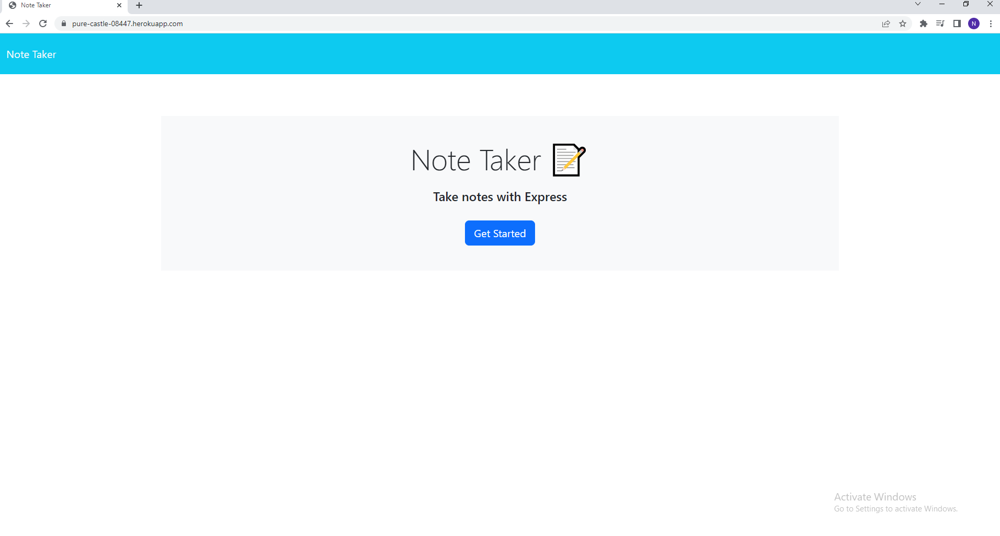
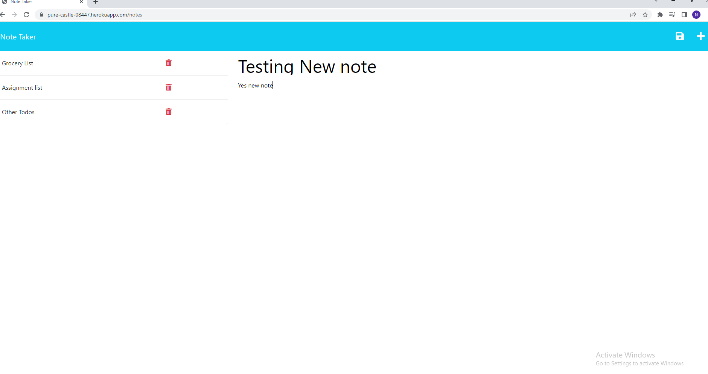

# note_taker_app

An application to write and save notes. This application uses an express backend and save and retrieve note data from a JSON file.

## Screenshots

### Home Page



### Notes Page



## Installation

To install necessary dependencies, run the following command:

```bash 
npm i
```
run the following command to start the server:

```bash
node server.js
```

## Deployed Application

[Note Taker App](https://pure-castle-08447.herokuapp.com/)

